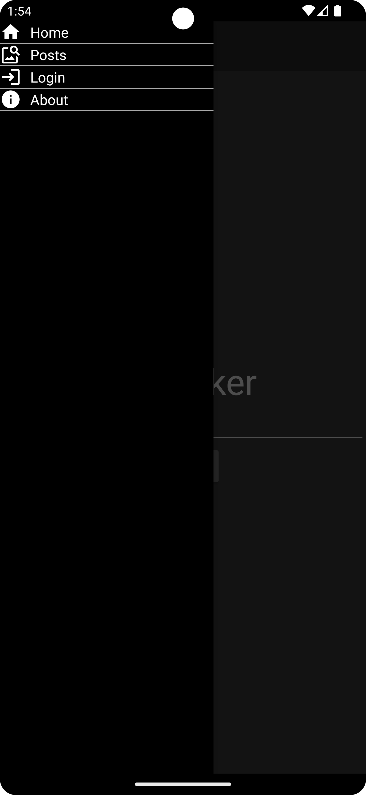
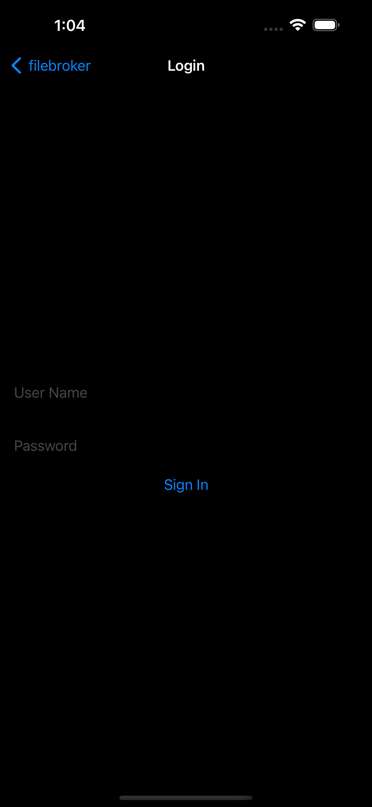
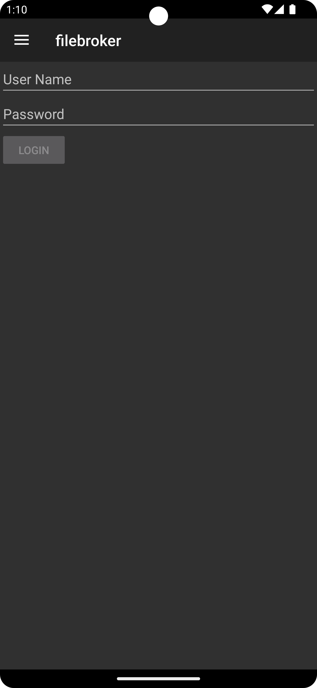
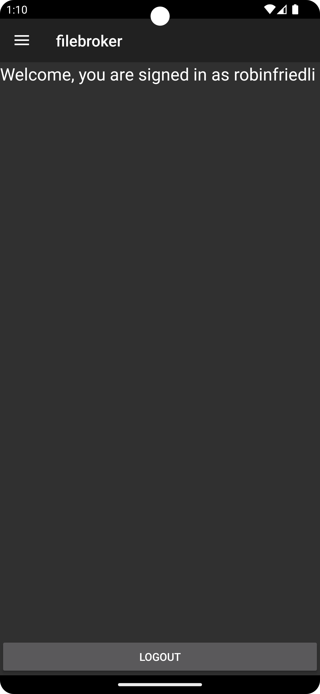
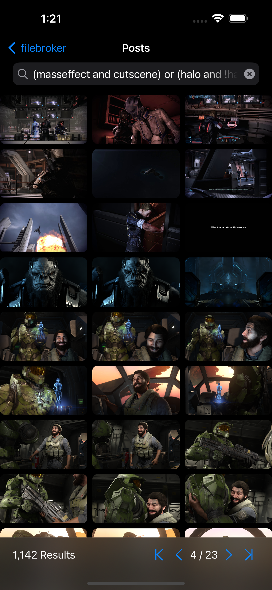
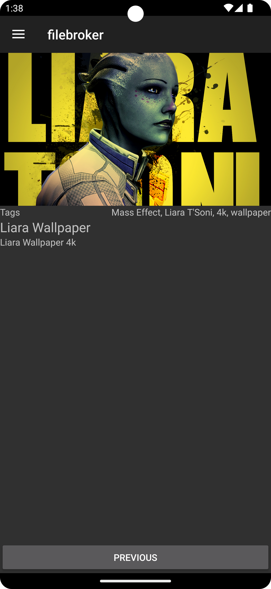
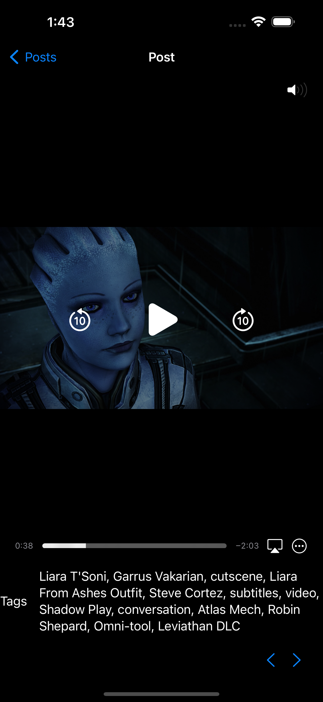
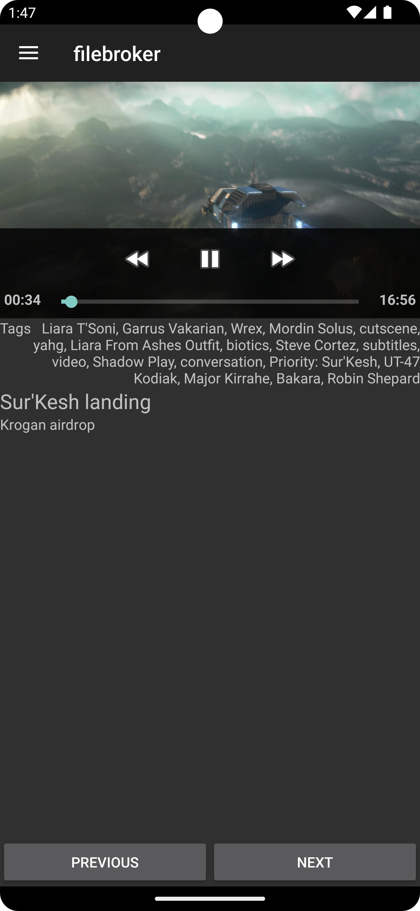

# filebroker-app
Kotlin Multiplatform Mobile App for the filebroker platform.

Filebroker is a platform to host files on configurable S3 compatible buckets and organise posts using a hierarchical tag system.

## Features
 * Kotlin Android UI and iOS SwiftUI
 * Integration with the filebroker API
 * Search for and view posts
 * View images and play videos
 * Persistent logins
 * Ready for localization
   * Uses string resources on Android
   * Provided out of the box through LocalizedStringKey

## Installation

Set up your environment following [Jetbrain's documentation](https://kotlinlang.org/docs/multiplatform-mobile-setup.html). Requires the Kotlin Multiplatform Mobile Plugin for Android Studio. Running the iOS App requires Xcode.

## Home
The home view provides a search bar to search for posts. On iOS the home view also includes the navigation items for the next views. On Android those navigation items are found within the drawer menu.

  

## Login and Profile
After a successful login, the label of the navigation item for the login view is changed to the name of the user and the navigation links to the profile view instead.

   

## Post search
Upon entering a search term (using the filebroker query language) or using the corresponding navigation link the user is navigated to the post search page, which provides a search bar, scrollable grid view of thumbnails from the resulting posts that navigate to the post view when clicked, as well as pagination buttons.

 

## Post
The post view displays the image or video player for the selected post, additional metadata about the post (title, description and tags) and navigation items to the previous and next post in the current selection.

   
